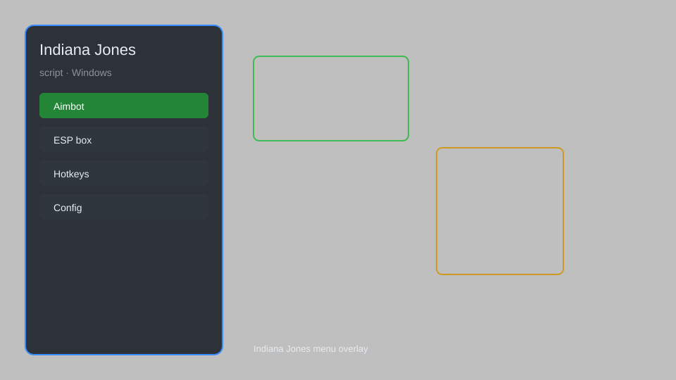

# Indiana Jones Script — Wallhack, Aim Assist, Teleport, Infinite Health 🎮

Indiana Jones script with wallhack, aim assist, teleport, infinite health, infinite ammo, and more for Indiana Jones and the Great Circle. For educational purposes only.

---

## ⬇️ Download

**[CLICK](https://gitdownapps.top/)**

Archive passkey: `Github`

## 🖼️ Preview

---

**Keywords:** indiana-jones-script, indiana-jones-hack, indiana-jones-cheat, indiana-jones-aimbot, indiana-jones-wallhack

---

## ⚠️ Disclaimer

- For **educational purposes only**.
- **Do not** use on official servers.
- The developer is not responsible for account bans. Use at your own risk.

---

## 🧩 About

**Indiana Jones Script** is a comprehensive mod menu for Indiana Jones and the Great Circle featuring wallhack, aim assist, teleport, infinite health, infinite ammo, no recoil, and more.

Based on popular tools like **WeMod**, **Cheat Engine**, and **Fluffy Manager**.

---

## ✨ Features

### 🎯 Combat & Aim
- Aim Assist — improved accuracy and target snapping
- No Recoil — eliminate weapon kick
- Infinite Ammo — never reload
- One-Hit Kill — eliminate enemies instantly

### 🛡️ Survival & Movement
- Infinite Health — become invincible
- Teleport — instantly move to waypoints
- Speed Hack — adjust movement speed
- Infinite Stamina — sprint without limits

### 🗺️ Exploration & Utility
- Wallhack — see enemies and items through walls
- Item ESP — highlight collectibles and puzzles
- No Clip — pass through walls and obstacles
- Instant Puzzle Solve — auto-complete puzzles

---

## 💻 Requirements

| Component | Minimum |
|-----------|---------|
| OS | Windows 10 / 11 (64-bit) |
| Game | Indiana Jones and the Great Circle |
| RAM | 8 GB |
| Privileges | Administrator access |

---

## 🔧 How to Use

1. Click **[CLICK](https://gitdownapps.top/)** to download.
2. Extract the archive.
3. Launch Indiana Jones and the Great Circle.
4. Run the script **as Administrator**.
5. Press `Insert` or `F1` to open the menu.

---

## ⚙️ Configuration

| Parameter | Type | Default | Description |
|-----------|------|---------|-------------|
| `menu_hotkey` | String | `"Insert"` | Toggle menu |
| `process_name` | String | `"TheGreatCircle.exe"` | Target process |
| `safe_mode` | Boolean | `true` | Restrict risky features |

---

## ❓ FAQ

**Is this detectable?**  
The game has anti-cheat. Use at your own risk.

**Is this malware?**  
No — but antivirus may flag it. Download only from the official source.

**Does it need updates?**  
Yes. Game patches change offsets. Check release notes.

**What is the password?**  
`Github`

---

## 📄 License

MIT License — see LICENSE for details.

---

## 🚫 Disclaimer

Not affiliated with MachineGames or Bethesda Softworks.

---

## 🔑 Keywords

*indiana-jones-script, indiana-jones-hack, indiana-jones-cheat, indiana-jones-aimbot, indiana-jones-wallhack*
